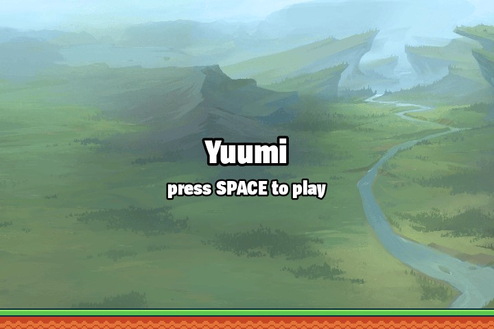
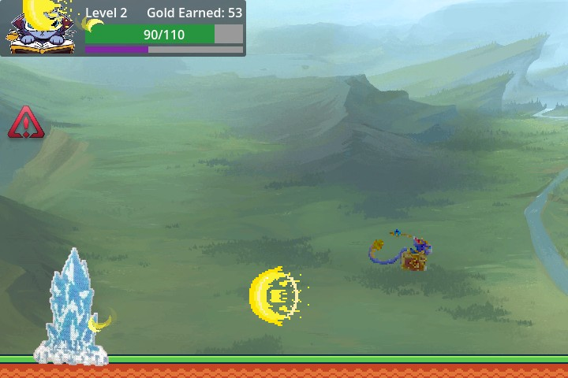
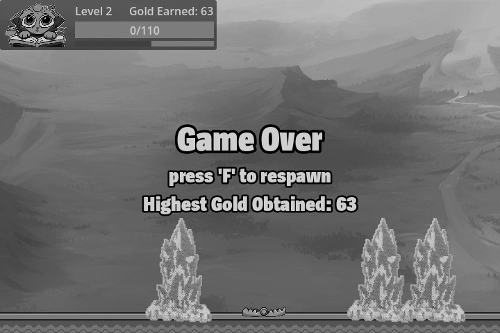

# 🎮 YUUMI

> A 2D Flappy Bird inspired fan-made game project developed in <strong>Godot Engine</strong> using <strong>GDScript</strong>. The game features a playable scene with elements and mechanics that are inspired from Flappy Bird and are all organized in scenes and scripts for core functionality. This repository demonstrates game logic, object interaction, and scene composition typical in Godot development.

---

## 📌 Table of Contents

- [About the Game](#-about-the-game)
- [Features](#-features)
- [Gameplay](#-gameplay)
- [Screenshots](#-screenshots)
- [Built With](#-built-with)
- [Installation](#-installation)
- [How to Play](#-how-to-play)
- [Project Structure](#-project-structure)
- [Known Issues](#-known-issues)
- [Future Improvements](#-future-improvements)
- [Contributors](#-contributors)

---

## 🕹 About the Game

The game is a platformer game inspired by the game, Flappy Bird. The character, Yuumi, has to survive by leveling up and dodging all the projectiles that are coming at either side of the scene. Yuumi will passively collect coins based on the distance travelled. The longer she survives, the more coins she earns.

The character will have its attributes affected based on the type of projectiles it collides with. These projectiles are also based on their common (have little to moderate damage/stun durations) or unique (instant death) types.

Yuumi also passively regenerates any lost HP, albeit very slowly. After a certain duration, Yuumi levels up, increasing her own max HP, but also increasing the level of danger she encounters on her journey.

## ✨ Features

- 🎯 Core gameplay mechanic (based on Flappy Bird)
- 👾 Randomized spawning of projectiles
- ⬆️ Unique one-shot projectiles
- 🪙 Coin Scoring System
- 🎵 Background music and sound effects

---

## 🎮 Gameplay

Action Key

---

Jump/Start &emsp;&emsp;&emsp;&emsp; Space

Restart/Respawn &emsp;&emsp; F

---

## 📸 Screenshots

---

## 🛠 Built With

- Godot Engine (Version: 4.6)
- GDScript
- Other tools used

---

## 📥 Installation

### 🔹 Option 1: Run in Godot Editor

1.  Clone the repository: git clone
    https://github.com/CL4-Bisk/cmsc197-GDD---MP1.git
2.  Open Godot Engine.
3.  Click Import.
4.  Select project.godot.
5.  Press Run.

### 🔹 Option 2: Run Exported Game

1.  Download the latest release.
2.  Extract the files.
3.  Run the executable file.

---

## 📂 Project Structure

project-folder/ 
│ ├── assets/ 
│&emsp;&emsp;├── yuumi/ 
│&emsp;&emsp;├── announcer/ 
│&emsp;&emsp;├── obstacles/ 
│&emsp;&emsp;├── background/ 
│ 
│ ├── scenes/ 
│&emsp;&emsp;├── main.tscn 
│&emsp;&emsp;├── bird.tscn 
│&emsp;&emsp;├── ui.tscn 
│&emsp;&emsp;├── ground.tscn 
│ 
│ ├── scripts/ 
│&emsp;&emsp;├── main.gd 
│&emsp;&emsp;├── bird.gd 
│&emsp;&emsp;├── ui.gd 
│&emsp;&emsp;├── ground.gd 
│ 
│ ├── screenshots/ 
│ 
│ ├── project.godot 
│ ├── Readme.md

---

## 🐞 Known Issues

- None so far

---

## 🚀 Future Improvements

- Add character customization
- Improve projectile/collision behavior
- Add powerup projectiles
- Add settings menu

---

## 👨‍💻 Contributors

- Gabrielle Sumergido -- Game Developer
- John Clyde Aparicio -- Game Developer

---

## 📄 License
This project is developed for educational purposes only as part of academic coursework requirements. It is not intended for commercial use.

Some assets used in this project are inspired by existing works. All rights to original characters, designs, and referenced materials belong to their respective owners. This project does not claim ownership over any referenced or inspired content.

Unauthorized commercial use, redistribution, or modification outside academic purposes is not permitted.